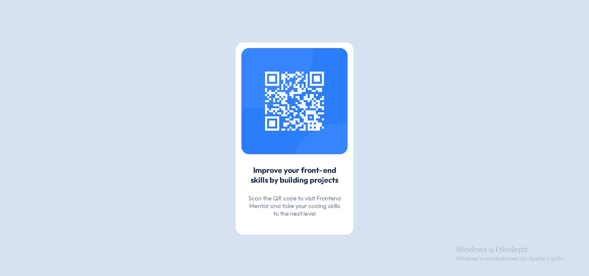

# Frontend Mentor - QR code component solution

## Overview

### Screenshot

### Built with

- Semantic HTML5 markup
- CSS custom properties
- Flexbox

### What I learned

I have learned how to align the container vertically using Flexbox.

### Continued development

I will continue learning CSS Grid and Flexbox features, and I will start JavaScript as soon as possible

### Useful resources

- https://www.w3schools.com/css/css3_flexbox.asp

